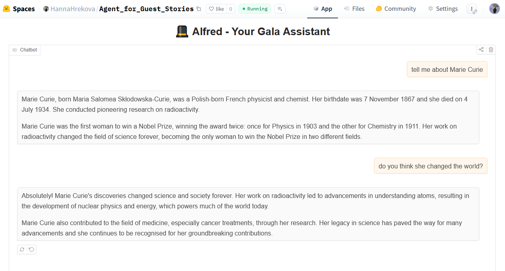

# 🧠 Alfred — AI Multi-Tool Assistant

**Alfred** is a LangGraph-based agent using **CohereLabs/c4ai-command-r-v01** to assist with multiple tasks involving guest information, web search, weather updates, statistics, and conversational memory.

This project was developed as part of the [Hugging Face Agents Course](https://huggingface.co/learn/agents-course), Unit 3.

---

## 💡 What Alfred Can Do

| Capability                                                        | Example Prompt                                        |
| ----------------------------------------------------------------- | ----------------------------------------------------- |
| 🧑‍💼 Retrieve guest info using hybrid search (BM25 + embeddings)  | `Tell me about our guest Ada Lovelace`                |
| 🌐 Search the web in real time (DuckDuckGo)                       | `Who is the current CEO of OpenAI?`                   |
| 🌤️ Provide weather updates (mocked)                               | `What's the weather like in Tokyo today?`             |
| 📈 Return statistics (mocked)                                     | `Give me the latest stats on AI adoption`             |
| 🧠 Maintain memory across turns                                   | `Tell me again about the guest we mentioned earlier`  |
| 🧩 Combine multiple tools                                         | `Tell me about Alan Turing and the weather in London` |

---

## ⚙️ Tech Stack

    LLM: CohereLabs/c4ai-command-r-v01
    Frameworks: LangGraph, LangChain
    Tools:
        Guest Info Retrieval (BM25 + SentenceTransformer)
        DuckDuckGo Web Search
        Youtube QA Tool
        Weather Info (mocked)
        Statistics Tool (mocked)
    Interface: Gradio (app.py)

---

## 📁 Project Structure
```
project/
│
├── .gitattributes         # Git settings
├── README.md              # Project documentation
├── app.py                 # Gradio interface
├── requirements.txt       # Dependencies
├── retriever.py           # Guest info + web search tools
└── tools.py               # LangGraph agent setup
```

### 🧪 Agent Alfred demonstration: answer to a query about Marie Curie



## 👤 Author

Created by **Hanna Hrekova**, AI enthusiast and lifelong learner.  
Built with ❤️ for the Hugging Face community.
